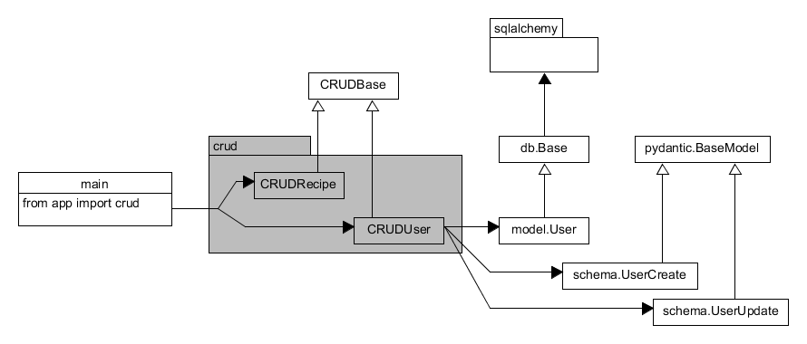

# fastapi-primer
A learning project to get FastAPI + SQLAlchemy to work for me

## Stages 1-7
### FastAPI is like Flask
```python
from fastapi import FastAPI, APIRouter
...

app = FastAPI(title="Recipe API", openapi_url="/openapi.json")
api_router = APIRouter()

...

@api_router.get("/recipe/{recipe_id}", status_code=200, response_model=Recipe)
def fetch_recipe(*, recipe_id: int, db: Session = Depends(deps.get_db)) -> Any:
    "Fetch a single recipe by ID"
    result = crud.recipe.get(db, recipe_id)
    if not result:
        raise HTTPException(
            status_code=404,
            detail=f"Recipe with ID {recipe_id} is not found"
        )
    
    return result

...

app.include_router(api_router)


if __name__ == "__main__":
    import uvicorn
    uvicorn.run(app, host="0.0.0.0", port=8001, log_level="debug")
```

### Working with data: pydantic (schema) + SQLAlchemy (model)


<details>
    <summary>Click to expand code examples!</summary>
    
**`./app/main.py`**
```python
...
from sqlalchemy.orm import Session
...
from app.schemas import Recipe, RecipeCreate, RecipeSearchResults
from app import deps
from app import crud

...

app = FastAPI(title="Recipe API", openapi_url="/openapi.json")
api_router = APIRouter()


@api_router.get("/", status_code=200)
def root(request: Request, db: Session = Depends(deps.get_db)) -> dict:   # Session is being used to get CRUD working
    """ Root GET """
    recipes = crud.recipe.get_multi(db=db, limit=10)                      # Here is the CRUD at work
    return TEMPLATES.TemplateResponse(
        "index.html",
        {"request": request, "recipes": recipes}
    )


@api_router.get("/recipe/{recipe_id}", status_code=200, response_model=Recipe)
def fetch_recipe(*, recipe_id: int, db: Session = Depends(deps.get_db)) -> Any:
    "Fetch a single recipe by ID"
    result = crud.recipe.get(db, recipe_id)
    if not result:
        raise HTTPException(
            status_code=404,
            detail=f"Recipe with ID {recipe_id} is not found"
        )
    
    return result
```

**`./app/crud/__init__.py`**
```python
from .crud_recipe import recipe
from .crud_user import user
```

**`./app/crud/crud_user.py`**
```python
from typing import Any, Dict, Optional, Union
from sqlalchemy.orm import Session

from app.crud.base import CRUDBase
from app.models.user import User
from app.schemas.user import UserCreate, UserUpdate

class CRUDUser(CRUDBase[User, UserCreate, UserUpdate]):
    def get_by_email(self, db: Session, *, email: str) -> Optional[User]:
        return db.query(User).filter(User.email == email).first()
    
    def update(self, db: Session, *, db_obj: User, obj_in: Union[UserUpdate, Dict[str, Any]]) -> User:
        if isinstance(obj_in, dict):
            update_data = obj_in
        else:
            update_data = obj_in.dict(exclude_unset=True)

        return super().update(db, db_obj=db_obj, obj_in=update_data)
    
    def is_superuser(self, user: User) -> bool:
        return user.is_superuser


user = CRUDUser(User)
```

**`./app/schemas/user.py`**
```python
from typing import Optional
from pydantic import BaseModel, EmailStr


class UserBase(BaseModel):
    first_name: Optional[str]
    surname: Optional[str]
    email: Optional[EmailStr]
    is_superuser: bool = False


# Properties to receive via API on creation
class UserCreate(UserBase):
    email: EmailStr


# Properties to receive via API on update
class UserUpdate(UserBase):
    ...
```

**`./app/models/user.py`:**
```python
from sqlalchemy import Column, Integer, String, Boolean
from sqlalchemy.orm import relationship

from app.db.base_class import Base

class User(Base):
    id = Column(Integer, primary_key=True, index=True)
    first_name = Column(String(256), nullable=True)
    surname = Column(String(256), nullable=True)
    email = Column(String, index=True, nullable=False)
    is_superuser = Column(Boolean, default=False)
    recipes = relationship(
        "Recipe",
        cascade="all,delete-orphan",
        back_populates="submitter",
        uselist=True
    )
```

[CRUD's base.py is worth looking at too](app/crud/base.py)
    
</details>

Some more advanced explanations are in [Ultimate FastAPI tutorial](https://christophergs.com/tutorials/ultimate-fastapi-tutorial-pt-7-sqlalchemy-database-setup/)

## Migrations with alembic

First, install alembic:

`pip install alembic`

Or it might be installed already, if you did `pip install -r requirements.txt`
Then generate `alembic` folder and `alembic.ini` file:

```alembic init alembic```

Edit `alembic.ini` to amend one row:

```
sqlalchemy.url = sqlite:///example.db
```

Then edit `alembic/env.py` file to add your metadata:

```python
# add your model's MetaData object here
# for 'autogenerate' support
# from myapp import mymodel
# target_metadata = mymodel.Base.metadata
# target_metadata = None
from app.db.base import Base
from app.db.session import SQLALCHEMY_DATABASE_URI
target_metadata = Base.metadata
```

Generate first revision:

```
alembic revision --autogenerate -m "Initial DB creation"
```

And push the revision into `example.db`:

```
alembic upgrade head
```
